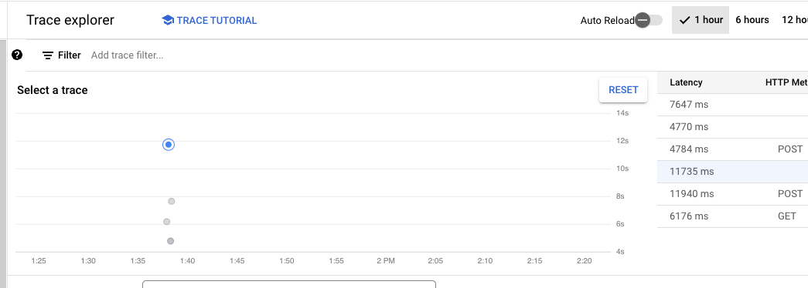
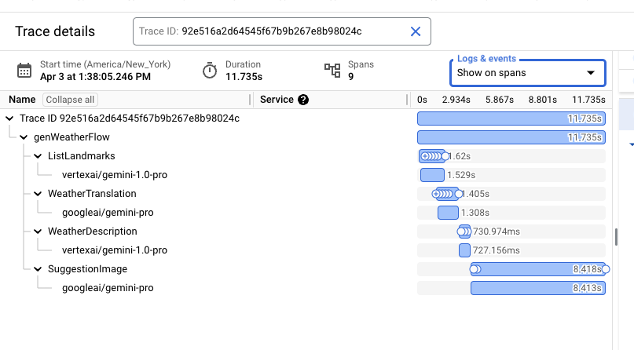
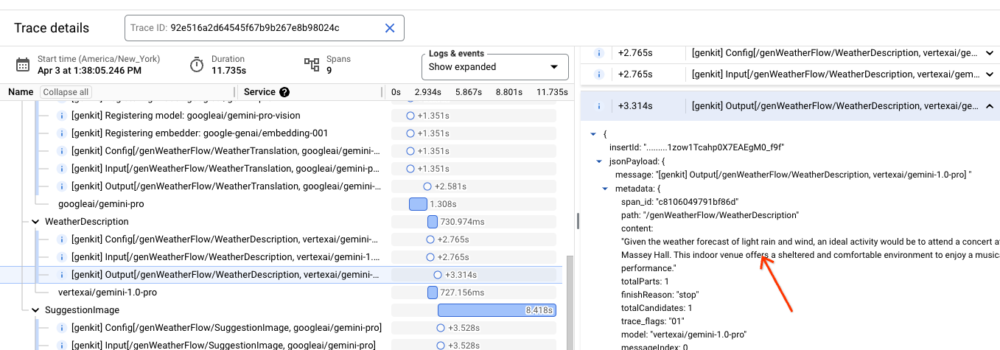
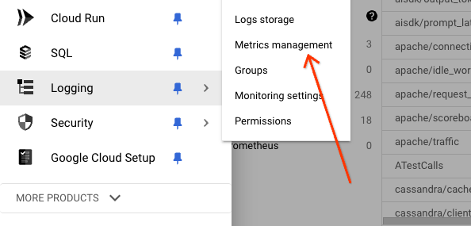
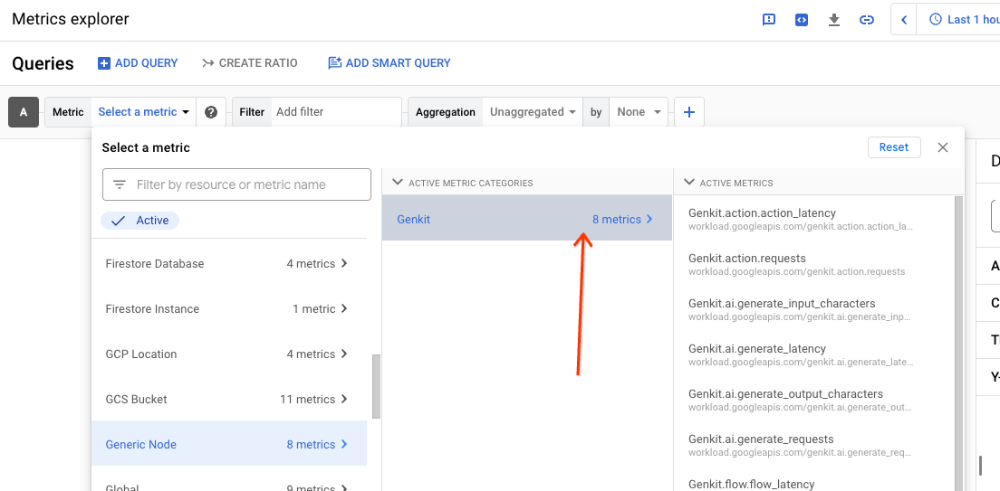
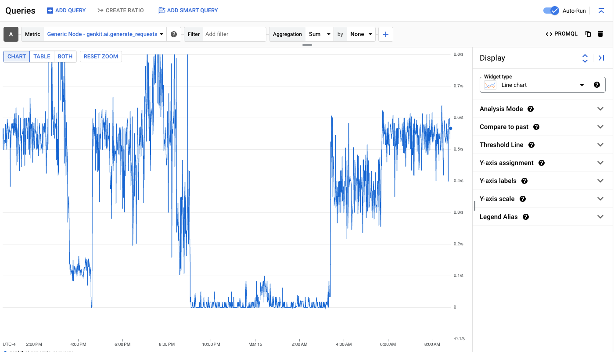

The Google Cloud plugin exports Genkit's telemetry and logging data to
[Google Cloud's operation suite](https://cloud.google.com/products/operations).

Note: Logging is facilitated by the `slog` package
in favor of the [OpenTelemetry](https://opentelemetry.io/) logging APIs. Export
of logs is done via a dedicated Google Cloud exporter.

## Prerequisites

If you want to locally run flows that use this plugin, you need the
[Google Cloud CLI tool](https://cloud.google.com/sdk/docs/install) installed.

## Set up a Google Cloud account

This plugin requires a Google Cloud account ([sign up](https://cloud.google.com/gcp) if you don't already have one) and a Google Cloud project.

Prior to adding the plugin, make sure that the following APIs are enabled for your project:

- [Cloud Logging API](https://console.cloud.google.com/apis/library/logging.googleapis.com)
- [Cloud Trace API](https://console.cloud.google.com/apis/library/cloudtrace.googleapis.com)
- [Cloud Monitoring API](https://console.cloud.google.com/apis/library/monitoring.googleapis.com)

These APIs should be listed in the [API dashboard](https://console.cloud.google.com/apis/dashboard) for your project.

Click [here](https://support.google.com/googleapi/answer/6158841) to learn more about enabling and disabling APIs.

## Configuration

To enable exporting to Google Cloud Tracing, Logging, and Monitoring, import the
`googlecloud` package and run `Init()`. After calling `Init()`, your telemetry
gets automatically exported.

```go
package main

import (
	"context"
	"log"
	"time" // Import time package for duration

	"github.com/firebase/genkit/go/genkit"
	"github.com/firebase/genkit/go/plugins/googlecloud"
	"golang.org/x/exp/slog" // Import slog for log level
)

func main() {
	ctx := context.Background()

	// Example initialization
	err := googlecloud.Init(ctx, &googlecloud.Config{
		ProjectID:      "your-gcp-project-id", // Replace with your Project ID
		ForceExport:    false,                 // Set to true to force export in dev env
		MetricInterval: 60 * time.Second,      // Example: 60 seconds interval
		LogLevel:       slog.LevelInfo,        // Example: Info level
	})
	if err != nil {
		log.Fatalf("Failed to initialize Google Cloud plugin: %v", err)
	}

	// Initialize Genkit with the plugin (if not already done elsewhere)
	// g, err := genkit.Init(ctx, genkit.WithPlugins(&googlecloud.Plugin{})) // Plugin instance might be needed depending on usage
	// if err != nil {
	// 	log.Fatalf("Genkit initialization failed: %v", err)
	// }

	log.Println("Google Cloud plugin initialized successfully.")
	// ... rest of your application logic ...
}
```

You must specify the Google Cloud project to which you want to export telemetry
data. There are also some optional parameters:

- `ProjectID`: (Required) Your Google Cloud project ID.
- `ForceExport`: Export telemetry data even when running in a dev environment
  (such as when using `genkit start` or `genkit flow:run`). This is a quick way
  to test your integration and send your first events for monitoring in Google
  Cloud.

  If you use this option, you also need to make your Cloud credentials available
  locally:

  ```bash
  gcloud auth application-default login
  ```

- `MetricInterval`: The interval (`time.Duration`) at which to export telemetry
  information. By default, this is 60 seconds.
- `LogLevel`: The minimum severity level (`slog.Level`) of log entries to export. By default,
  `slog.LevelInfo`.

The plugin requires your Google Cloud project credentials. If you're running
your flows from a Google Cloud environment (Cloud Run, etc), the credentials are
set automatically. Running in other environments requires setting up
[Application Default Credentials](https://cloud.google.com/docs/authentication/provide-credentials-adc).

## Production monitoring via Google Cloud's operations suite

Once a flow is deployed, navigate to [Google Cloud's operations suite](https://console.cloud.google.com/) and select your project.


### Logs and traces

From the side menu, find 'Logging' and click 'Logs explorer'.


You will see all logs that are associated with your deployed flow, including `console.log()`. Any log which has the prefix `[genkit]` is a Genkit-internal log that contains information that may be interesting for debugging purposes. For example, Genkit logs in the format `Config[...]` contain metadata such as the temperature and topK values for specific LLM inferences. Logs in the format `Output[...]` contain LLM responses while `Input[...]` logs contain the prompts. Cloud Logging has robust ACLs that allow fine grained control over sensitive logs.

> Note: Prompts and LLM responses are redacted from trace attributes in Cloud Trace.

For specific log lines, it is possible to navigate to their respective traces by clicking on the extended menu  icon and selecting "View in trace details".

 

This will bring up a trace preview pane providing a quick glance of the details of the trace. To get to the full details, click the "View in Trace" link at the top right of the pane.

 

The most prominent navigation element in Cloud Trace is the trace scatter plot. It contains all collected traces in a given time span.

 

Clicking on each data point will show its details below the scatter plot.

 

The detailed view contains the flow shape, including all steps, and important timing information. Cloud Trace has the ability to interleave all logs associated with a given trace within this view. Select the "Show expanded" option in the "Logs & events" drop down.

 

The resultant view allows detailed examination of logs in the context of the trace, including prompts and LLM responses.

 

### Metrics

Viewing all metrics that Genkit exports can be done by selecting "Logging" from the side menu and clicking on "Metrics management".



The metrics management console contains a tabular view of all collected metrics, including those that pertain to Cloud Run and its surrounding environment. Clicking on the 'Workload' option will reveal a list that includes Genkit-collected metrics. Any metric with the `genkit` prefix constitutes an internal Genkit metric.


Genkit collects several categories of metrics, including flow-level, action-level, and generate-level metrics. Each metric has several useful dimensions facilitating robust filtering and grouping.

Common dimensions include:

- `flow_name` - the top-level name of the flow.
- `flow_path` - the span and its parent span chain up to the root span.
- `error_code` - in case of an error, the corresponding error code.
- `error_message` - in case of an error, the corresponding error message.
- `model` - the name of the model.
- `temperature` - the inference temperature [value](https://ai.google.dev/docs/concepts#model-parameters).
- `topK` - the inference topK [value](https://ai.google.dev/docs/concepts#model-parameters).
- `topP` - the inference topP [value](https://ai.google.dev/docs/concepts#model-parameters).

#### Flow-level metrics

| Name                 | Dimensions                           |
| -------------------- | ------------------------------------ |
| genkit/flow/requests | flow_name, error_code, error_message |
| genkit/flow/latency  | flow_name                            |

#### Action-level metrics

| Name                   | Dimensions                           |
| ---------------------- | ------------------------------------ |
| genkit/action/requests | flow_name, error_code, error_message |
| genkit/action/latency  | flow_name                            |

#### Generate-level metrics

| Name                                 | Dimensions                                                           |
| ------------------------------------ | -------------------------------------------------------------------- |
| genkit/ai/generate                   | flow_path, model, temperature, topK, topP, error_code, error_message |
| genkit/ai/generate/input_tokens      | flow_path, model, temperature, topK, topP                            |
| genkit/ai/generate/output_tokens     | flow_path, model, temperature, topK, topP                            |
| genkit/ai/generate/input_characters  | flow_path, model, temperature, topK, topP                            |
| genkit/ai/generate/output_characters | flow_path, model, temperature, topK, topP                            |
| genkit/ai/generate/input_images      | flow_path, model, temperature, topK, topP                            |
| genkit/ai/generate/output_images     | flow_path, model, temperature, topK, topP                            |
| genkit/ai/generate/latency           | flow_path, model, temperature, topK, topP, error_code, error_message |

Visualizing metrics can be done through the Metrics Explorer. Using the side menu, select 'Logging' and click 'Metrics explorer'


Select a metrics by clicking on the "Select a metric" dropdown, selecting 'Generic Node', 'Genkit', and a metric.



The visualization of the metric will depend on its type (counter, histogram, etc). The Metrics Explorer provides robust aggregation and querying facilities to help graph metrics by their various dimensions.



## Telemetry Delay

There may be a slight delay before telemetry for a particular execution of a flow is displayed in Cloud's operations suite. In most cases, this delay is under 1 minute.

## Quotas and limits

There are several quotas that are important to keep in mind:

- [Cloud Trace Quotas](http://cloud.google.com/trace/docs/quotas)
  - 128 bytes per attribute key
  - 256 bytes per attribute value
- [Cloud Logging Quotas](http://cloud.google.com/logging/quotas)
  - 256 KB per log entry
- [Cloud Monitoring Quotas](http://cloud.google.com/monitoring/quotas)

## Cost

Cloud Logging, Cloud Trace, and Cloud Monitoring have generous free tiers. Specific pricing can be found at the following links:

- [Cloud Logging Pricing](http://cloud.google.com/stackdriver/pricing#google-cloud-observability-pricing)
- [Cloud Trace Pricing](https://cloud.google.com/trace#pricing)
- [Cloud Monitoring Pricing](https://cloud.google.com/stackdriver/pricing#monitoring-pricing-summary)
